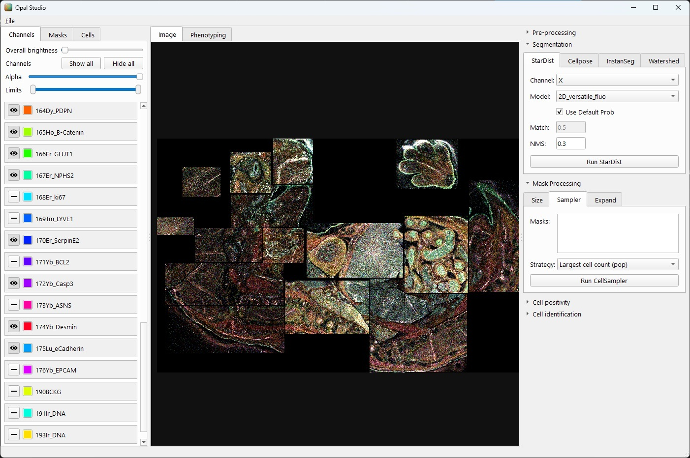

# Opal Studio




**Opal Studio** is a high-performance, cross-platform image viewer and analysis application designed for highly multiplexed imaging data, including IMC (Imaging Mass Cytometry) and large OME-TIFF files. 

Built using PySide6 and leveraging a state-of-the-art Python data stack, Opal Studio offers native, responsive interfaces and robust multi-channel visualization, segmentation, and phenotyping workflows.

## Key Features

- **High-Performance Multi-Channel Viewing**: Load and dynamically manipulate dozens of high-resolution channels on the fly with native GPU-accelerated rendering.
- **Advanced Pre-processing**: Built-in normalization, CLAHE (Contrast Limited Adaptive Histogram Equalization), and morphological filters (Median, Tophat).
- **Multi-Engine AI Segmentation**: Deep integration with modern AI segmentation models:
    - **InstanSeg**: Fast, state-of-the-art nucleus and cell segmentation.
    - **StarDist (2D)**: Robust nuclear segmentation using star-convex polygons.
    - **Cellpose**: Integrated support for Cyto, Nuclei, and custom models.
    - **Omnipose**: Dedicated support for bacterial, plant, and high-res worm segmentation.
    - **Watershed**: Traditional marker-controlled region expansion for classical workflows.
- **Intelligent Mask Processing**: 
    - **Cell Sampler (Ubermasking)**: Geometrically merge results from multiple segmentation engines using intelligent strategies (Jaccard agreement, Population density, Area variance).
    - **Size Filtering**: Dynamically remove segmented regions based on area constraints.
    - **Watershed Expansion**: Expand nucleus masks into cell boundaries while maintaining neighborhood topology.
- **Phenotyping & Analysis**: 
    - **Interactive Phenotyping Grid**: Define cell types by mapping marker positivity (+/-) in an intuitive table.
    - **AI Cell Positivity**: Automated detection of marker expression using integrated deep learning models (Marker-CNN).
    - **Data Interoperability**: Full support for OME-TIFF mask export and CSV-based phenotyping configurations.
- **Commercial-Grade UI**: Fully responsive, dark-mode native interface built for professional research environments.

## Installation

Opal Studio relies on standard data science and imaging libraries. We recommend installing it within a Conda environment.

1. **Clone the repository**:
   ```bash
   git clone https://github.com/TristanWhitmarsh/opal-studio.git
   cd opal-studio
   ```

2. **Create and activate the environment**:
   Using the provided `environment.yml`:
   ```bash
   conda env create -f environment.yml
   conda activate opal-env
   ```

3. **Install the package (Editable mode)**:
   ```bash
   pip install -e .
   ```

## Usage

To launch Opal Studio, activate your environment and execute the application module:

```bash
conda activate opal-env
python -m opal_studio
```

### Quick Start
1. **Load Image**: `File > Open Image` to load `.ome.tiff`, `.tiff`, or other standard formats.
2. **Visualize**: Use the left **Channel Panel** to toggle visibility, adjust brightness/contrast, and assign colors.
3. **Segment**: Open the right **Operations Panel**, select a segmentation engine (e.g., StarDist or InstanSeg), and click **Run**.
4. **Phenotype**: Switch to the **Phenotyping** tab in the center area to define cell populations or use the **Cell Positivity** AI in the right panel.
5. **Export**: Use `File > Save Masks` to export your results as multi-channel OME-TIFFs.

## License

Opal Studio is licensed under the **MIT License** with the **Commons Clause**.

- ✅ **Free for use:** Researchers, academic labs, and companies are welcome to use Opal Studio for free to carry out their internal work.
- ✅ **Free to modify:** You may inspect, modify, and develop upon the code.
- ❌ **Commercial Restriction:** You may **not** sell the software, nor offer it as a paid hosted service or commercial product. 

See the `LICENSE` file for the exact details.

